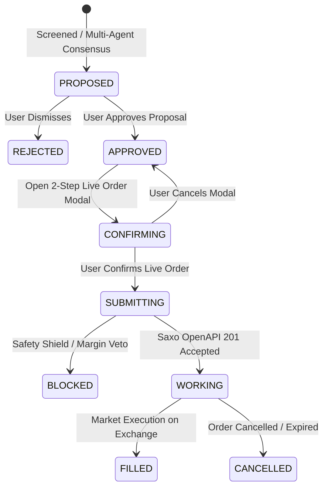

# [SPEC-SAXO-DESK-001] Strict Single Live Saxo Desk Engine

- **Status**: Implemented & Verified
- **Version**: 1.0.0
- **Domain**: Broker & Execution
- **Owning Modules**: `options_lab.api.saxo_client`, `options_lab.api.saxo_pipeline`, `options_lab.api.main`

---

## 1. Purpose & Engine Architecture
Options Lab enforces a **Strict Single Execution Engine Architecture**. 
- There are **zero simulated paper trading engines** or mock sandboxes in the primary execution flow.
- All portfolio balances, live option chains, position greeks, and order dispatches bind directly to the authentic **Saxo OpenAPI** execution desk.
- Real-money safety is enforced via a **Two-Stage Human-in-the-Loop Confirmation Protocol** and dynamic tick quantization.

---

## 2. Invariants

### `[SPEC-SAXO-DESK-001]`: Zero Simulated Paper Sandbox
- All proposed trades originate from authentic market quotes (`trade/v1/infoprices`) and execute exclusively via the Saxo OpenAPI trading gateway (`trade/v2/orders`).
- Fictitious paper order fills or disconnected sandboxes are strictly prohibited in the trading pipeline.

### `[SPEC-SAXO-DESK-002]`: OAuth 2.0 PKCE & Chrome Browser Redirect
- Authentication executes via Saxo OpenAPI standard OAuth 2.0 Authorization Code Flow with PKCE (`S256`).
- **Zero In-App Modal Sandboxing**: Desktop environments (`Electron`) are strictly prohibited from trapping authentication inside internal child `BrowserWindow` modals. Authentication MUST launch external **Google Chrome** directly (`chrome.exe` / `shell.openExternal(authUrl)`) to guarantee native support for hardware security keys (FIDO2/WebAuthn), Windows Hello, biometric MFA, and Chrome password autofill.
- **Web Tab Preservation**: Web clients MUST launch Saxo OAuth in an external tab (`window.open(authUrl, '_blank')`) to prevent destroying active OptionsLab session telemetry when Saxo redirects to the registered external redirect URI (`https://Akpegis-Agent.com.sg`).
- **Automated Background Clipboard Interceptor**: When Google Chrome is launched, the desktop runtime MUST activate a background clipboard polling sentinel (90s TTL, 500ms cycle) that automatically intercepts any copied Saxo callback URL containing `code=` or UUID, auto-exchanges the code via `POST /api/broker/oauth/set-token`, notifies the renderer, and brings the OptionsLab window to the foreground.

### `[SPEC-SAXO-DESK-003]`: Multi-Tier Token Persistence
- OAuth access tokens, refresh tokens, and expiry timestamps persist across three resilient storage tiers:
  1. Primary: `broker_tokens` table in SQLite database (`optionslab.db`).
  2. Secondary: Host-mounted `options_lab/api/data/saxo_tokens.json`.
  3. Tertiary: Host `.env` variables (`SAXO_ACCESS_TOKEN`, `SAXO_REFRESH_TOKEN`).
- Container updates (`update_backend.sh`) must execute memory extraction before process termination to guarantee no active session is lost.

### `[SPEC-SAXO-DESK-004]`: Mandatory Two-Stage Human Confirmation
- Proposed trades enter the blotter in state `PROPOSED`.
- User review transitions trade to `APPROVED`.
- Submission to Saxo OpenAPI requires explicit user interaction with a dedicated **Live Order Confirmation Modal** detailing:
  - Exact Contract Symbol, Strike, and Expiry.
  - Quantized Limit Price ($\ge \text{Tick Size}$).
  - Required Margin Collateral and Available Portfolio Headroom.
  - Number of Contracts.
- Only upon explicit modal submission does the client issue `POST /api/broker/orders/execute`.

### `[SPEC-SAXO-DESK-005]`: Safety Lock Flag (`BROKER_ALLOW_LIVE_EXECUTION`)
- Even when authenticated, live order placement is intercepted by the Safety Shield unless `settings.BROKER_ALLOW_LIVE_EXECUTION` is explicitly `True`.
- When disabled, the desk returns `LIVE_EXECUTION_BLOCKED_BY_SAFETY_SHIELD` with an actionable audit trail, preventing unintentional order transmission.

---

## 3. Order Lifecycle State Machine

---

## 4. Verification & Traceability Matrix

| Invariant ID | Test File | Test Assertion | Status |
| :--- | :--- | :--- | :--- |
| `[SPEC-SAXO-DESK-001]` | `tests/unit/test_saxo_live.py` | Verify live Saxo OpenAPI client order dispatch | PASS |
| `[SPEC-SAXO-DESK-002]` | `options_lab/test_api.py` | Verify `/api/broker/auth/url` returns valid PKCE URL | PASS |
| `[SPEC-SAXO-DESK-003]` | `tests/unit/test_saxo_live.py` | Verify multi-tier token recovery from SQLite and file | PASS |
| `[SPEC-SAXO-DESK-004]` | `options_lab/test_candidate_summary.py` | Verify staged order transition from PROPOSED to APPROVED | PASS |
| `[SPEC-SAXO-DESK-005]` | `options_lab/api/test_saxo_live.py` | Verify safety shield blocks orders when flag is False | PASS |
